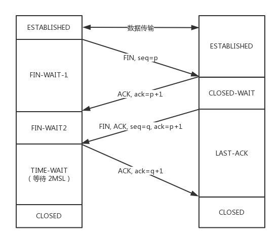

从浏览器接收url到开启网络请求线程
多进程的浏览器
浏览器是多进程的，有一个主控进程，以及每一个tab页面都会新开一个进程（某些情况下多个tab会合并进程）

进程可能包括主控进程，插件进程，GPU，tab页（浏览器内核）等等

Browser进程：浏览器的主进程（负责协调、主控），只有一个
第三方插件进程：每种类型的插件对应一个进程，仅当使用该插件时才创建
GPU进程：最多一个，用于3D绘制
浏览器渲染进程（内核）：默认每个Tab页面一个进程，互不影响，控制页面渲染，脚本执行，事件处理等（有时候会优化，如多个空白tab会合并成一个进程）

##解析url

url 组成

    protocol，协议头，譬如有http，ftp等
    host，主机域名或IP地址
    port，端口号
    path，目录路径
    query，即查询参数
    fragment，即#后的hash值，一般用来定位到某个位置
    
###网络请求都是单独的线程
    每次网络请求时都需要开辟单独的线程进行，譬如如果URL解析到http协议，就会新建一个网络线程去处理资源下载
    
    因此浏览器会根据解析出得协议，开辟一个网络线程，前往请求资源（这里，暂时理解为是浏览器内核开辟的，如有错误，后续修复）
    
####DNS解析

根 DNS 服务器 ：返回顶级域 DNS 服务器的 IP 地址

顶级域 DNS 服务器：返回权威 DNS 服务器的 IP 地址

权威 DNS 服务器 ：返回相应主机的 IP 地址
example:www.baidu.com
+查询本地dns ext/hosts文件
+发出dns查询请求 url对应ip 是什么 给本地dns服务器，在自动配置情况下是由DHCP服务器配置的地址 
+本地服务器有就返回 没有本地服务器会去根域名服务器（全球移一共13个）www.baidu.com 返回.com哪个的顶级域名服务器ip
+本地服务器再去访问顶级域名服务器 baidu.com 返回二级域名的权威服务的ip
+这个服务器上，还是会设置一个CNAME，指向另外一个域名，也即CDN网络的全局负载均衡器。
>badai.com权威服务有简单负载均衡如
- 轮训

- wight 权重几率
- 服务器响应时间
- url哈希判断

> GSLB 全局负载均衡
+ DNS版

>其实，了解了DNS解析域名的过程之后，基于DNS的GSLB工作流程也就比较清晰了。用户在对于GSLB所调度的资源进行域名解析的时候，
也会请求Local DNS，然后Local DNS再将请求转发到一组权威DNS服务器；DNS服务器会根据请求用户的IP地址判断其地理位置，
并且还会根据各个内容服务器的健康状况，返回一个或者一组对于用户最优的服务器IP（A记录）；
用户拿到了这些IP，就会去这些对应的服务器上面请求资源。

>有可能返回设置 CNAME 如 www.open.baidu.com

>会返回一组  dns轮训 一般取第一个ip 
> dns ip定位不准 

+ http重定向

>直接重定向ip 
优点是：由于直接向用户发送HTTP重定向指令，可以得到用户的真实IP，从而解决了判断不准确的问题。其缺点是只能为HTTP访问重定向。
1)     地理区域或用户自定义区域：将若干条IP地址前缀划分一个区域为。根据用户本地DNS的IP地址，将特定IP范围的用户优先分配到某个通过健康检查的站点。

2)     IP地址权重：可以为DNS应答中的每个IP地址分配权重，权重决定与其他候选IP相比分配到该IP的流量比例。

3)     往返时间（Round Trip Time, RTT）：RTT策略是基于区域之外最常用的策略。有两种模式的RTT测量：Active RTT测量与Passive RTT测量。在实际部署中，由于网络限制和性能原因，Active RTT往往无法使用，Passive RTT更实用一些。

>app专用httpDNS web 有跨域 cookie 问题

HttpDNS的原理非常简单，主要有两步：

A、客户端直接访问HttpDNS接口，获取业务在域名配置管理系统上配置的访问延迟最优的IP。（基于容灾考虑，还是保留次选使用运营商LocalDNS解析域名的方式）

B、客户端向获取到的IP后就向直接往此IP发送业务协议请求。以Http请求为例，通过在header中指定host字段，向HttpDNS返回的IP发送标准的Http请求即可。

### tcp3次握手
tcp 是有状态的正式连接前链接前要先确定状态

SYN=Synchronize Sequence Numbers 同步序列号 创建一个连接
ACK=Acknowledgement 确认符 确认接收到的数据

序列号seq和确认号ack：

TCP会话的每一端都包含一个32位（bit）的序列号，该序列号被用来跟踪该端发送的数据量。每一个包中都包含序列号，
在接收端则通过确认号用来通知发送端数据成功接收

- 客户端和服务端都处于close状态。服务端处于LISTEN状态监听某个端口
- 服务端发起链接SYN 之后处于SYN-SENT状态
- 服务端收到发起的连接，返回SYN，并且ACK客户端的SYN，之后处于SYN-RCVD状态
### 四次挥手
 

### HTTPS层建立连接

第一步，客户端给出协议版本号、一个客户端生成的随机数（Client random），以及客户端支持的加密方法。

第二步，服务端确认双方使用的加密方法，并给出数字证书、以及一个服务器生成的随机数（Server random）。客户端会从于是从自己信任的CA仓库中，拿CA的证书里面的公钥去解密电商网站的证书。如果能够成功，则说明电商网站是可信的。这个过程中，你可能会不断往上追溯CA、CA的CA、CA的CA的CA，反正直到一个授信的CA，就可以了

第三步，客户端确认数字证书有效，然后生成一个新的随机数（Premaster secret），并使用数字证书中的公钥，加密这个随机数，发给服务端。

第四步，服务端使用自己的私钥，获取客户端发来的随机数（即Premaster secret）。

第五步，客户端和服务端根据约定的加密方法，使用前面的三个随机数，生成"对话密钥"（session key），用来加密接下来的整个对话过程

### 出网关 

HTTP报文
请求行
>方法 url http版本

请求首部
>Content-Type 之类

请求正文
>json

怎么交给传输层呢？也是用Socket进行程序设计。如果用的是浏览器，这些程序不需要你自己写，有人已经帮你写好了；如果在移动APP里面，一般会用一个HTTP的客户端工具来发送，并且帮你封装好。

HTTP协议是基于TCP协议的，所以它使用面向连接的方式发送请求，通过Stream二进制流的方式传给对方。当然，到了TCP层，它会把二进制流变成一个的报文段发送给服务器。

在TCP头里面，会有源端口号和目标端口号，目标端口号一般是服务端监听的端口号，源端口号在手机端，往往是随机分配一个端口号。这个端口号在客户端和服务端用于区分请求和返回，发给那个应用。

在IP头里面，都需要加上自己的地址（即源地址）和它想要去的地方（即目标地址）。当一个手机上线的时候，PGW会给这个手机分配一个IP地址，这就是源地址，而目标地址则是云平台的负载均衡器的外网IP地址。

在IP层，客户端需要查看目标地址和自己是否是在同一个局域网，计算是否是同一个网段，往往需要通过CIDR子网掩码来计算。

对于这个下单场景，目标IP和源IP不会在同一个网段，因而需要发送到默认的网关。一般通过DHCP分配IP地址的时候，同时配置默认网关的IP地址。

但是客户端不会直接使用默认网关的IP地址，而是发送ARP协议，来获取网关的MAC地址，然后将网关MAC作为目标MAC，自己的MAC作为源MAC，放入MAC头，发送出去。

###http 缓存

ETag 头

http1.0中的缓存控制：

Pragma：严格来说，它不属于专门的缓存控制头部，但是它设置no-cache时可以让本地强缓存失效（属于编译控制，来实现特定的指令，主要是因为兼容http1.0，所以以前又被大量应用）
Expires：服务端配置的，属于强缓存，用来控制在规定的时间之前，浏览器不会发出请求，而是直接使用本地缓存，注意，Expires一般对应服务器端时间，如Expires：Fri, 30 Oct 1998 14:19:41
If-Modified-Since/Last-Modified：这两个是成对出现的，属于协商缓存的内容，其中浏览器的头部是If-Modified-Since，而服务端的是Last-Modified，它的作用是，在发起请求时，如果If-Modified-Since和Last-Modified匹配，那么代表服务器资源并未改变，因此服务端不会返回资源实体，而是只返回头部，通知浏览器可以使用本地缓存。Last-Modified，顾名思义，指的是文件最后的修改时间，而且只能精确到1s以内
http1.1中的缓存控制：

Cache-Control：缓存控制头部，有no-cache、max-age等多种取值
Max-Age：服务端配置的，用来控制强缓存，在规定的时间之内，浏览器无需发出请求，直接使用本地缓存，注意，Max-Age是Cache-Control头部的值，不是独立的头部，譬如Cache-Control: max-age=3600，而且它值得是绝对时间，由浏览器自己计算
If-None-Match/E-tag：这两个是成对出现的，属于协商缓存的内容，其中浏览器的头部是If-None-Match，而服务端的是E-tag，同样，发出请求后，如果If-None-Match和E-tag匹配，则代表内容未变，通知浏览器使用本地缓存，和Last-Modified不同，E-tag更精确，它是类似于指纹一样的东西，基于FileEtag INode Mtime Size生成，也就是说，只要文件变，指纹就会变，而且没有1s精确度的限制。

Max-Age相比Expires？

Expires使用的是服务器端的时间

但是有时候会有这样一种情况-客户端时间和服务端不同步

那这样，可能就会出问题了，造成了浏览器本地的缓存无用或者一直无法过期

所以一般http1.1后不推荐使用Expires

而Max-Age使用的是客户端本地时间的计算，因此不会有这个问题

因此推荐使用Max-Age。

注意，如果同时启用了Cache-Control与Expires，Cache-Control优先级高。

E-tag相比Last-Modified？

Last-Modified：

表明服务端的文件最后何时改变的
它有一个缺陷就是只能精确到1s，
然后还有一个问题就是有的服务端的文件会周期性的改变，导致缓存失效
而E-tag：

是一种指纹机制，代表文件相关指纹
只有文件变才会变，也只要文件变就会变，
也没有精确时间的限制，只要文件一遍，立马E-tag就不一样了
如果同时带有E-tag和Last-Modified，服务端会优先检查E-tag

##浏览器解析

####DOM构建
   
    DOM 的构建
    当渲染进程收到导航的提交消息并开始接收 HTML 数据时，主线程开始解析文本字符串（HTML）并将其转换为文档对象模型（DOM）。
    
####子资源加载
    子资源加载
    网站通常使用图像、CSS 和 JavaScript 等外部资源，这些文件需要从网络或缓存加载。在解析构建 DOM 时，主线程会按处理顺序逐个请求它们，但为了加快速度，
    “预加载扫描器（preload scanner）”会同时运行。如果 HTML 文档中有  或 <link> 之类的内容，则预加载扫描器会查看由 HTML 解析器生成的标记，
    并在浏览器进程中向网络线程发送请求。
####JavaScript 阻塞解析
    当 HTML 解析器遇到 <script> 标记时，会暂停解析 HTML 文档，开始加载、解析并执行 JavaScript 代码。
    JavaScript 可以使用诸如 document.write() 的方法来改写文档，
    这会改变整个 DOM 结构（HTML 规范里的 overview of the parsing model 中有一张不错的图片）。
    这就是 HTML 解析器必须等待 JavaScript 运行后再继续解析 HTML 文档原因。
   
####提示浏览器如何加载资源
    Web 开发者可以通过多种方式向浏览器发送提示，以便很好地加载资源。如果你的 JavaScript 不使用 document.write()，
    你可以在 <script> 标签添加 async 或 defer 属性，这样浏览器会异步加载运行 JavaScript 代码，而不阻塞解析。如果合适
    ，你也可以使用 JavaScript 模块。可以使用 <link rel="preload"> 告知浏览器当前导航肯定需要该资源，并且你希望尽快下载
####绘制具体过程
    
######Render Object
    首先我们有DOM树，但是DOM树里面的DOM是供给JS/HTML/CSS用的，并不能直接拿过来在页面或者位图里绘制。因此浏览器内部实现了Render Object：
    
    每个Render Object和DOM节点一一对应。Render Object上实现了将其对应的DOM节点绘制进位图的方法，负责绘制这个DOM节点的可见内容如背景、
    边框、文字内容等等。同时Render Object也是存放在一个树形结构中的。
    
    既然实现了绘制每个DOM节点的方法，那是不是可以开辟一段位图空间，然后DFS遍历这个新的Render Object树然后执行每个Render Object的绘制方法
    就可以将DOM绘制进位图了？就像“盖章”一样，把每个Render Object的内容一个个的盖到纸上（类比于此时的位图）是不是就完成了绘制。
    
    不，浏览器还有个层叠上下文。就是决定元素间相互覆盖关系(比如z-index)的东西。这使得文档流中位置靠前位置的元素有可能覆盖靠后的元素。
    上述DFS过程只能无脑让文档流靠后的元素覆盖前面元素。
    
    因此，有了Render Layer。
    
######层叠上下文
    文档中的层叠上下文由满足以下任意一个条件的元素形成：
    
    根元素 (HTML),
    z-index 值不为 "auto"的 绝对/相对定位，
    一个 z-index 值不为 "auto"的 flex 项目 (flex item)，即：父元素 display: flex|inline-flex，
    opacity 属性值小于 1 的元素（参考 the specification for opacity），
    transform 属性值不为 "none"的元素，
    mix-blend-mode 属性值不为 "normal"的元素，
    filter值不为“none”的元素，
    perspective值不为“none”的元素，
    isolation 属性被设置为 "isolate"的元素，
    position: fixed
    在 will-change 中指定了任意 CSS 属性，即便你没有直接指定这些属性的值（参考 这篇文章）
    -webkit-overflow-scrolling 属性被设置 "touch"的元素
######Render Object->Render Layer
    它是页面的root节点
    
    它具有显式的CSS position属性（relative, absolute or a transform）
    
    它是transparent
    
    有 overflow, an alpha mask or reflection
    
    有一个CSS滤镜
    
    对应于具有3D（WebGL）上下文或加速2D上下文的<canvas>元素
    
    对应于<video>元素
######Render Layer
    当然Render Layer的出现并不是简单因为层叠上下文等，比如opacity小于1、比如存在mask等等需要先绘制好内容再对绘制出来的内容做一些统一处理的css效果。
    
    总之就是有层叠、半透明等等情况的元素（具体哪些情况请参考无线性能优化：Composite）就会从Render Object提升为Render Layer。不提升为Render Layer的Render Object从属于其父级元素中最近的那个Render Layer。当然根元素HTML自己要提升为Render Layer。
    
    因此现在Render Object树就变成了Render Layer树，每个Render Layer又包含了属于自己layer的Render Object。
######Render Layer提升为Graphics Layer的情况：
      
       3D 或透视变换(perspective、transform) CSS 属性
       使用加速视频解码的 元素
       拥有 3D (WebGL) 上下文或加速的 2D 上下文的 元素
       混合插件(如 Flash)
       对 opacity、transform、fliter、backdropfilter 应用了 animation 或者 transition（需要是 active 的 animation 或者 transition，当 animation 或者 transition 效果未开始或结束后，提升合成层也会失效）
       will-change 设置为 opacity、transform、top、left、bottom、right（其中 top、left 等需要设置明确的定位属性，如 relative 等）
       拥有加速 CSS 过滤器的元素
       元素有一个 z-index 较低且包含一个复合层的兄弟元素(换句话说就是该元素在复合层上面渲染)
       ….. 所有情况的详细列表参见淘宝fed文章:无线性能优化：Composite
######Compositing Layer
    上面的过程可以搞定绘制过程。但是浏览器里面经常有动画、video、canvas、3d的css等东西。这意味着页面在有这些元素时，
    页面显示会经常变动，也就意味着位图会经常变动。每秒60帧的动效里，每次变动都重绘整个位图是很恐怖的性能开销。
    
    因此浏览器为了优化这一过程。引出了Graphics Layers和Graphics Context，前者就是我们常说的合成层(Compositing Layer)
    
    每个合成层Graphics Layer 都拥有一个 Graphics Context，Graphics Context 会为该Layer开辟一段位图，
    也就意味着每个Graphics Layer都拥有一个位图。Graphics Layer负责将自己的Render Layer及其子代所包含的Render Object绘制到位图里
    。然后将位图作为纹理交给GPU。所以现在GPU收到了HTML元素的Graphics Layer的纹理，
    也可能还收到某些因为有3d transform之类属性而提升为Graphics Layer的元素的纹理。
    
按照HTML5标准，scroll事件是每帧触发一次的，自带requestAnimationFrame节流效果
按照Blink和Webkit引擎实现，touchmove、mousemove等UI input由Compositor线程接收，但传入到主线程是每帧一次，也自带requestAnimationFrame节流效果
重绘是以合成层为单位的
合成层提升前后的Paint步骤